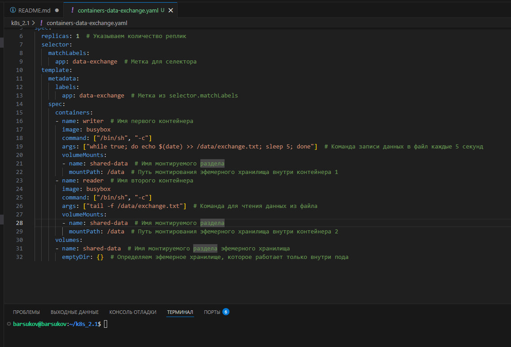
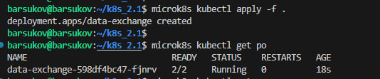
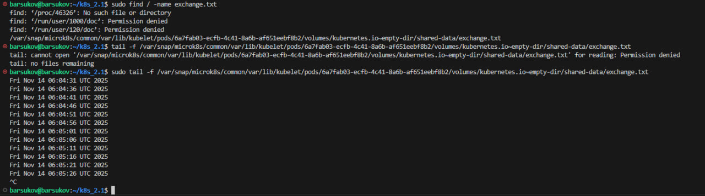
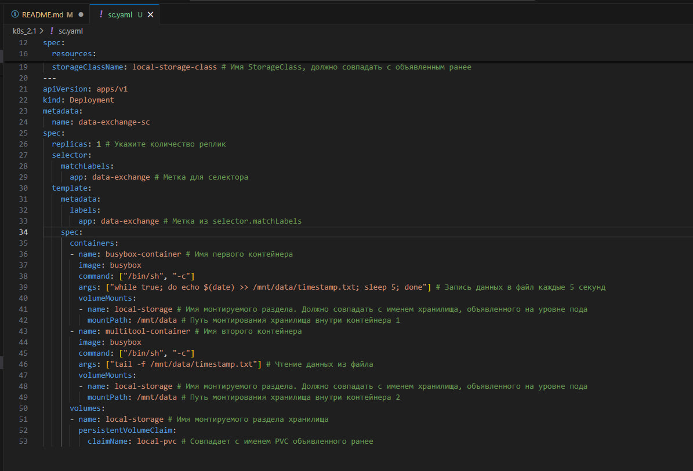

# Домашнее задание к занятию «Хранение в K8s» Барсуков Алексей

### Примерное время выполнения задания — 180 минут

### Цель задания

Научиться работать с хранилищами в тестовой среде Kubernetes:
- обеспечить обмен файлами между контейнерами пода;
- создавать **PersistentVolume** (PV) и использовать его в подах через **PersistentVolumeClaim** (PVC);
- объявлять свой **StorageClass** (SC) и монтировать его в под через **PVC**.

Это задание поможет вам освоить базовые принципы взаимодействия с хранилищами в Kubernetes — одного из ключевых навыков для работы с кластерами. На практике Volume, PV, PVC используются для хранения данных независимо от пода, обмена данными между подами и контейнерами внутри пода. Понимание этих механизмов поможет вам упростить проектирование слоя данных для приложений, разворачиваемых в кластере k8s.

------

## **Подготовка**
### **Чеклист готовности**

1. Установленное K8s-решение (допустим, MicroK8S).
2. Установленный локальный kubectl.
3. Редактор YAML-файлов с подключенным GitHub-репозиторием.

------

### Инструменты, которые пригодятся для выполнения задания

1. [Инструкция](https://microk8s.io/docs/getting-started) по установке MicroK8S.
2. [Инструкция](https://minikube.sigs.k8s.io/docs/start/?arch=%2Fwindows%2Fx86-64%2Fstable%2F.exe+download) по установке Minikube. 
3. [Инструкция](https://kubernetes.io/docs/tasks/tools/install-kubectl-windows/) по установке kubectl.
4. [Инструкция](https://marketplace.visualstudio.com/items?itemName=ms-kubernetes-tools.vscode-kubernetes-tools) по установке VS Code

### Дополнительные материалы, которые пригодятся для выполнения задания
1. [Описание Volumes](https://kubernetes.io/docs/concepts/storage/volumes/).
2. [Описание Ephemeral Volumes](https://kubernetes.io/docs/concepts/storage/volumes/).
3. [Описание PersistentVolume](https://kubernetes.io/docs/concepts/storage/persistent-volumes/).
4. [Описание PersistentVolumeClaim](https://kubernetes.io/docs/concepts/storage/persistent-volumes/#persistentvolumeclaims).
5. [Описание StorageClass](https://kubernetes.io/docs/concepts/storage/storage-classes/).
6. [Описание Multitool](https://github.com/wbitt/Network-MultiTool).

------

## Задание 1. Volume: обмен данными между контейнерами в поде
### Задача

Создать Deployment приложения, состоящего из двух контейнеров, обменивающихся данными.

### Шаги выполнения
1. Создать Deployment приложения, состоящего из контейнеров busybox и multitool.
2. Настроить busybox на запись данных каждые 5 секунд в некий файл в общей директории.
3. Обеспечить возможность чтения файла контейнером multitool.


### Что сдать на проверку
- Манифесты:
  - `containers-data-exchange.yaml`
- Скриншоты:
  - описание пода с контейнерами (`kubectl describe pods data-exchange`)
  - вывод команды чтения файла (`tail -f <имя общего файла>`)


### решение





Вывод команды kubectl describe pods data-exchange.

```
kubectl describe pods data-exchange
Name:             data-exchange-598df4bc47-fjnrv
Namespace:        default
Priority:         0
Service Account:  default
Node:             barsukov.vm/10.200.10.8
Start Time:       Fri, 14 Nov 2025 08:56:13 +0300
Labels:           app=data-exchange
                  pod-template-hash=598df4bc47
Annotations:      cni.projectcalico.org/containerID: abbc55f46b0f61fef2ab28a6a04a87e548b638a299690be5d94b1d3885bdf437
                  cni.projectcalico.org/podIP: 10.1.10.210/32
                  cni.projectcalico.org/podIPs: 10.1.10.210/32
Status:           Running
IP:               10.1.10.210
IPs:
  IP:           10.1.10.210
Controlled By:  ReplicaSet/data-exchange-598df4bc47
Containers:
  writer:
    Container ID:  containerd://d084edf1465d5939f45f0545c395fde88266db9d203a3f158d5fcb8288695f50
    Image:         busybox
    Image ID:      docker.io/library/busybox@sha256:e3652a00a2fabd16ce889f0aa32c38eec347b997e73bd09e69c962ec7f8732ee
    Port:          <none>
    Host Port:     <none>
    Command:
      /bin/sh
      -c
    Args:
      while true; do echo $(date) >> /data/exchange.txt; sleep 5; done
    State:          Running
      Started:      Fri, 14 Nov 2025 08:56:21 +0300
    Ready:          True
    Restart Count:  0
    Environment:    <none>
    Mounts:
      /data from shared-data (rw)
      /var/run/secrets/kubernetes.io/serviceaccount from kube-api-access-wfml7 (ro)
  reader:
    Container ID:  containerd://9524f9f382c2671fa5eeb62e3607ec5ab40e57c97167ddc05ca326c1d53a1476
    Image:         busybox
    Image ID:      docker.io/library/busybox@sha256:e3652a00a2fabd16ce889f0aa32c38eec347b997e73bd09e69c962ec7f8732ee
    Port:          <none>
    Host Port:     <none>
    Command:
      /bin/sh
      -c
    Args:
      tail -f /data/exchange.txt
    State:          Running
      Started:      Fri, 14 Nov 2025 08:56:22 +0300
    Ready:          True
    Restart Count:  0
    Environment:    <none>
    Mounts:
      /data from shared-data (rw)
      /var/run/secrets/kubernetes.io/serviceaccount from kube-api-access-wfml7 (ro)
Conditions:
  Type                        Status
  PodReadyToStartContainers   True 
  Initialized                 True 
  Ready                       True 
  ContainersReady             True 
  PodScheduled                True 
Volumes:
  shared-data:
    Type:       EmptyDir (a temporary directory that shares a pod's lifetime)
    Medium:     
    SizeLimit:  <unset>
  kube-api-access-wfml7:
    Type:                    Projected (a volume that contains injected data from multiple sources)
    TokenExpirationSeconds:  3607
    ConfigMapName:           kube-root-ca.crt
    Optional:                false
    DownwardAPI:             true
QoS Class:                   BestEffort
Node-Selectors:              <none>
Tolerations:                 node.kubernetes.io/not-ready:NoExecute op=Exists for 300s
                             node.kubernetes.io/unreachable:NoExecute op=Exists for 300s
Events:
  Type    Reason     Age   From               Message
  ----    ------     ----  ----               -------
  Normal  Scheduled  84s   default-scheduler  Successfully assigned default/data-exchange-598df4bc47-fjnrv to barsukov.vm
  Normal  Pulling    84s   kubelet            Pulling image "busybox"
  Normal  Pulled     78s   kubelet            Successfully pulled image "busybox" in 6.182s (6.182s including waiting). Image size: 2224358 bytes.
  Normal  Created    78s   kubelet            Created container: writer
  Normal  Started    77s   kubelet            Started container writer
  Normal  Pulling    77s   kubelet            Pulling image "busybox"
  Normal  Pulled     76s   kubelet            Successfully pulled image "busybox" in 1.066s (1.066s including waiting). Image size: 2224358 bytes.
  Normal  Created    76s   kubelet            Created container: reader
  Normal  Started    76s   kubelet            Started container reader
```

Вывод команды tail -f /data/exchange.txt (или аналогичной команды для чтения файла).



------

## Задание 2. PV, PVC
### Задача
Создать Deployment приложения, использующего локальный PV, созданный вручную.

### Шаги выполнения
1. Создать Deployment приложения, состоящего из контейнеров busybox и multitool, использующего созданный ранее PVC
2. Создать PV и PVC для подключения папки на локальной ноде, которая будет использована в поде.
3. Продемонстрировать, что контейнер multitool может читать данные из файла в смонтированной директории, в который busybox записывает данные каждые 5 секунд. 
4. Удалить Deployment и PVC. Продемонстрировать, что после этого произошло с PV. Пояснить, почему. (Используйте команду `kubectl describe pv`).
5. Продемонстрировать, что файл сохранился на локальном диске ноды. Удалить PV.  Продемонстрировать, что произошло с файлом после удаления PV. Пояснить, почему.


### Что сдать на проверку
- Манифесты:
  - `pv-pvc.yaml`
- Скриншоты:
  - каждый шаг выполнения задания, начиная с шага 2.
- Описания:
  - объяснение наблюдаемого поведения ресурсов в двух последних шагах.


### решение

```
barsukov@barsukov:~/k8s_2.1$ microk8s kubectl apply -f pv-pvc.yaml
persistentvolume/local-pv created
persistentvolumeclaim/local-pvc created
deployment.apps/data-exchange-pvc created
barsukov@barsukov:~/k8s_2.1$ microk8s kubectl get pods
NAME                                 READY   STATUS    RESTARTS   AGE
data-exchange-598df4bc47-m5rfg       2/2     Running   0          117s
data-exchange-pvc-5695dbbfb5-vnfs7   2/2     Running   0          25s
barsukov@barsukov:~/k8s_2.1$ 
```
Удаление Deployment и PVC

```
barsukov@barsukov:~/k8s_2.1$ microk8s kubectl delete deployment data-exchange-pvc
deployment.apps "data-exchange-pvc" deleted
barsukov@barsukov:~/k8s_2.1$ microk8s kubectl delete pvc local-pvc
persistentvolumeclaim "local-pvc" deleted
barsukov@barsukov:~/k8s_2.1$ microk8s kubectl describe pv local-pv
Name:            local-pv
Labels:          <none>
Annotations:     pv.kubernetes.io/bound-by-controller: yes
Finalizers:      [kubernetes.io/pv-protection]
StorageClass:    
Status:          Released
Claim:           default/local-pvc
Reclaim Policy:  Retain
Access Modes:    RWO
VolumeMode:      Filesystem
Capacity:        1Gi
Node Affinity:   <none>
Message:         
Source:
    Type:          HostPath (bare host directory volume)
    Path:          /mnt/data
    HostPathType:  
Events:            <none>
barsukov@barsukov:~/k8s_2.1$ microk8s kubectl get pods
NAME                             READY   STATUS    RESTARTS   AGE
data-exchange-598df4bc47-m5rfg   2/2     Running   0          3m57s
barsukov@barsukov:~/k8s_2.1$ 
```

После удаления PVC, PV останется в состоянии "Released", так как он был привязан к PVC, поскольку политика persistentVolumeReclaimPolicy установлена на Retain, данные на локальном диске сохранятся.


```
barsukov@barsukov:~/k8s_2.1$ sudo find / -name timestamp.txt
/mnt/data/timestamp.txt
find: ‘/proc/56935’: No such file or directory
find: ‘/proc/56936’: No such file or directory
find: ‘/proc/56941’: No such file or directory
find: ‘/proc/57014’: No such file or directory
find: ‘/run/user/1000/doc’: Permission denied
find: ‘/run/user/120/doc’: Permission denied
barsukov@barsukov:~/k8s_2.1$ cat /mnt/data/timestamp.txt
Fri Nov 14 06:10:06 UTC 2025
Fri Nov 14 06:10:11 UTC 2025
Fri Nov 14 06:10:16 UTC 2025
Fri Nov 14 06:10:21 UTC 2025
Fri Nov 14 06:10:26 UTC 2025
Fri Nov 14 06:10:31 UTC 2025
Fri Nov 14 06:10:36 UTC 2025
Fri Nov 14 06:10:41 UTC 2025
Fri Nov 14 06:10:46 UTC 2025
Fri Nov 14 06:10:51 UTC 2025
Fri Nov 14 06:10:56 UTC 2025
Fri Nov 14 06:11:01 UTC 2025
Fri Nov 14 06:11:06 UTC 2025
Fri Nov 14 06:11:11 UTC 2025
Fri Nov 14 06:11:16 UTC 2025
Fri Nov 14 06:11:22 UTC 2025
Fri Nov 14 06:11:27 UTC 2025
Fri Nov 14 06:11:32 UTC 2025
Fri Nov 14 06:11:37 UTC 2025
Fri Nov 14 06:11:42 UTC 2025
Fri Nov 14 06:11:47 UTC 2025
Fri Nov 14 06:11:52 UTC 2025
barsukov@barsukov:~/k8s_2.1$ 
```


При удалении PV с политикой Retain, данные остаются на диске. Однако если бы была установлена политика Delete, данные также были бы удалены вместе с PV

------

## Задание 3. StorageClass
### Задача
Создать Deployment приложения, использующего PVC, созданный на основе StorageClass.

### Шаги выполнения

1. Создать Deployment приложения, состоящего из контейнеров busybox и multitool, использующего созданный ранее PVC.
2. Создать SC и PVC для подключения папки на локальной ноде, которая будет использована в поде.
3. Продемонстрировать, что контейнер multitool может читать данные из файла в смонтированной директории, в который busybox записывает данные каждые 5 секунд.

### Что сдать на проверку
- Манифесты:
  - `sc.yaml`
- Скриншоты:
  - каждый шаг выполнения задания, начиная с шага 2

### решение



```
barsukov@barsukov:~/k8s_2.1$ kubectl apply -f pv-pvc.yaml
persistentvolume/local-pv unchanged
Warning: Detected changes to resource local-pvc which is currently being deleted.
persistentvolumeclaim/local-pvc unchanged
deployment.apps/data-exchange-pvc unchanged
barsukov@barsukov:~/k8s_2.1$ microk8s kubectl get pods
NAME                                 READY   STATUS    RESTARTS   AGE
data-exchange-pvc-5695dbbfb5-s42xl   2/2     Running   0          5m16s
data-exchange-sc-8695f5fbd9-hjgbc    2/2     Running   0          2m26s
barsukov@barsukov:~/k8s_2.1$ sudo find / -name timestamp.txt
[sudo] password for barsukov: 
/mnt/data/timestamp.txt
find: ‘/proc/100286’: No such file or directory
find: ‘/proc/100316’: No such file or directory
find: ‘/proc/100317’: No such file or directory
find: ‘/proc/100322’: No such file or directory
find: ‘/run/user/1000/doc’: Permission denied
find: ‘/run/user/120/doc’: Permission denied
barsukov@barsukov:~/k8s_2.1$ cat /mnt/data/timestamp.txt
Fri Nov 14 06:10:06 UTC 2025
Fri Nov 14 06:10:11 UTC 2025
Fri Nov 14 06:10:16 UTC 2025
Fri Nov 14 06:10:21 UTC 2025
Fri Nov 14 06:10:26 UTC 2025
Fri Nov 14 06:10:31 UTC 2025
Fri Nov 14 06:10:36 UTC 2025
Fri Nov 14 06:10:41 UTC 2025
Fri Nov 14 06:10:46 UTC 2025
Fri Nov 14 06:10:51 UTC 2025
Fri Nov 14 06:10:56 UTC 2025
Fri Nov 14 06:11:01 UTC 2025
Fri Nov 14 06:11:06 UTC 2025
Fri Nov 14 06:11:11 UTC 2025
Fri Nov 14 06:11:16 UTC 2025
Fri Nov 14 06:11:22 UTC 2025
Fri Nov 14 06:11:27 UTC 2025
Fri Nov 14 06:11:32 UTC 2025
Fri Nov 14 06:11:37 UTC 2025
Fri Nov 14 06:11:42 UTC 2025
Fri Nov 14 06:11:47 UTC 2025
Fri Nov 14 06:11:52 UTC 2025
Fri Nov 14 06:42:28 UTC 2025
Fri Nov 14 06:42:33 UTC 2025
Fri Nov 14 06:42:39 UTC 2025
Fri Nov 14 06:42:44 UTC 2025
Fri Nov 14 06:42:49 UTC 2025
Fri Nov 14 06:42:54 UTC 2025
Fri Nov 14 06:42:59 UTC 2025
Fri Nov 14 06:43:04 UTC 2025
Fri Nov 14 06:43:09 UTC 2025
Fri Nov 14 06:43:09 UTC 2025
Fri Nov 14 06:43:14 UTC 2025
Fri Nov 14 06:43:14 UTC 2025
Fri Nov 14 06:43:19 UTC 2025
Fri Nov 14 06:43:19 UTC 2025
Fri Nov 14 06:43:24 UTC 2025
Fri Nov 14 06:43:24 UTC 2025
Fri Nov 14 06:43:29 UTC 2025
Fri Nov 14 06:43:29 UTC 2025
Fri Nov 14 06:43:34 UTC 2025
Fri Nov 14 06:43:34 UTC 2025
Fri Nov 14 06:43:39 UTC 2025
Fri Nov 14 06:43:39 UTC 2025
Fri Nov 14 06:43:44 UTC 2025
Fri Nov 14 06:43:44 UTC 2025
Fri Nov 14 06:43:49 UTC 2025
Fri Nov 14 06:43:49 UTC 2025
Fri Nov 14 06:43:54 UTC 2025
Fri Nov 14 06:43:54 UTC 2025
Fri Nov 14 06:43:59 UTC 2025
Fri Nov 14 06:43:59 UTC 2025
Fri Nov 14 06:44:04 UTC 2025
Fri Nov 14 06:44:04 UTC 2025
Fri Nov 14 06:44:09 UTC 2025
Fri Nov 14 06:44:09 UTC 2025
Fri Nov 14 06:44:14 UTC 2025
Fri Nov 14 06:44:14 UTC 2025
Fri Nov 14 06:44:19 UTC 2025
Fri Nov 14 06:44:19 UTC 2025
Fri Nov 14 06:44:24 UTC 2025
Fri Nov 14 06:44:24 UTC 2025
Fri Nov 14 06:44:29 UTC 2025
Fri Nov 14 06:44:29 UTC 2025
Fri Nov 14 06:44:34 UTC 2025
Fri Nov 14 06:44:34 UTC 2025
Fri Nov 14 06:44:39 UTC 2025
Fri Nov 14 06:44:39 UTC 2025
Fri Nov 14 06:44:44 UTC 2025
Fri Nov 14 06:44:44 UTC 2025
Fri Nov 14 06:44:49 UTC 2025
Fri Nov 14 06:44:49 UTC 2025
Fri Nov 14 06:44:54 UTC 2025
Fri Nov 14 06:44:54 UTC 2025
Fri Nov 14 06:44:59 UTC 2025
Fri Nov 14 06:44:59 UTC 2025
Fri Nov 14 06:45:04 UTC 2025
Fri Nov 14 06:45:04 UTC 2025
Fri Nov 14 06:45:09 UTC 2025
Fri Nov 14 06:45:09 UTC 2025
Fri Nov 14 06:45:14 UTC 2025
Fri Nov 14 06:45:14 UTC 2025
Fri Nov 14 06:45:19 UTC 2025
Fri Nov 14 06:45:19 UTC 2025
Fri Nov 14 06:45:24 UTC 2025
Fri Nov 14 06:45:24 UTC 2025
Fri Nov 14 06:45:29 UTC 2025
Fri Nov 14 06:45:29 UTC 2025
Fri Nov 14 06:45:34 UTC 2025
Fri Nov 14 06:45:34 UTC 2025
Fri Nov 14 06:45:39 UTC 2025
Fri Nov 14 06:45:39 UTC 2025
Fri Nov 14 06:45:44 UTC 2025
Fri Nov 14 06:45:44 UTC 2025
Fri Nov 14 06:45:49 UTC 2025
Fri Nov 14 06:45:49 UTC 2025
Fri Nov 14 06:45:54 UTC 2025
Fri Nov 14 06:45:54 UTC 2025
barsukov@barsukov:~/k8s_2.1$ 
```


---
## Шаблоны манифестов с учебными комментариями
### 1. Deployment (containers-data-exchange.yaml)
```yaml
apiVersion: apps/v1
kind: Deployment
metadata:
  name: data-exchange
spec:
  replicas: # ЗАДАНИЕ: Укажите количество реплик
  selector:
    matchLabels:
      app: # ДОПОЛНИТЕ: Метка для селектора
  template:
    metadata:
      labels:
        app: # ПОВТОРИТЕ: Метка из selector.matchLabels
    spec:
      containers:
      - name: # ДОПОЛНИТЕ: Имя первого контейнера
        image: busybox
        command: ["/bin/sh", "-c"] 
        args: ["echo $(date) > путь_к_файлу; sleep 3600"] # КЛЮЧЕВОЕ: Команда записи данных в файл в директории из секции volumeMounts контейнера
        volumeMounts:
        - name: # ДОПОЛНИТЕ: Имя монтируемого раздела. Должно совпадать с именем эфемерного хранилища, объявленного на уровне пода.
          mountPath: # КЛЮЧЕВОЕ: Путь монтирования эфемерного хранилища внутри контейнера 1
      - name: # ДОПОЛНИТЕ: Имя второго контейнера
        image: busybox
        command: ["/bin/sh", "-c"]
        args: ["tail -f путь_к_файлу"] # КЛЮЧЕВОЕ: Команда для чтения данных из файла, расположенного в директории, указанной в volumeMounts контейнера
        volumeMounts:
        - name: # ДОПОЛНИТЕ: Имя монтируемого раздела. Должно совпадать с именем эфемерного хранилища, объявленного на уровне пода
          mountPath: # КЛЮЧЕВОЕ: Путь монтирования эфемерного хранилища внутри контейнера 2
      volumes:
      - name: # ДОПОЛНИТЕ: Имя монтируемого раздела эфемерного хранилища
        emptyDir: {} # ИНФОРМАЦИЯ: Определяем эфемерное хранилище, которое работает только внутри пода
```
### 2. Deployment (pv-pvc.yaml)
```yaml
---
apiVersion: v1
kind: PersistentVolume
metadata:
  name: # ДОПОЛНИТЕ: Имя хранилища
spec:
  capacity:
    storage: 1Gi
  volumeMode: Filesystem
  accessModes:
    - ReadWriteOnce
  persistentVolumeReclaimPolicy: Retain
  hostPath:
    path: # КЛЮЧЕВОЕ: Путь к директории на ноде (хосте, на котором развёрнут кластер)
---
apiVersion: v1
kind: PersistentVolumeClaim
metadata:
  name: # ДОПОЛНИТЕ: Имя PVC
spec:
  volumeName: # ДОПОЛНИТЕ: Имя PV, к которому будет привязан PVC, должен совпадать с созданным ранее PV
  volumeMode: Filesystem
  accessModes:
    - ReadWriteOnce
  resources:
    requests:
      storage: # ДОПОЛНИТЕ: Какой объём хранилища вы хотите передать в контейнер. Должно быть меньше или равно параметру storage из PV
---
apiVersion: apps/v1
kind: Deployment
metadata:
  name: data-exchange-pvc
spec:
  replicas: # ЗАДАНИЕ: Укажите количество реплик
  selector:
    matchLabels:
      app: # ДОПОЛНИТЕ: Метка для селектора
  template:
    metadata:
      labels:
        app: # ПОВТОРИТЕ: Метка из selector.matchLabels
    spec:
      containers:
      - name: # ДОПОЛНИТЕ: Имя первого контейнера
        image: busybox
        command: ["/bin/sh", "-c"] 
        args: ["echo $(date) > путь_к_файлу; sleep 3600"] # КЛЮЧЕВОЕ: Команда записи данных в файл в директории из секции volumeMounts контейнера 
        volumeMounts:
        - name: # ДОПОЛНИТЕ: Имя монтируемого раздела. Должно совпадать с именем хранилища, объявленного на уровне пода
          mountPath: # КЛЮЧЕВОЕ: Путь монтирования хранилища внутри контейнера 1
      - name: # ДОПОЛНИТЕ: Имя второго контейнера
        image: busybox
        command: ["/bin/sh", "-c"]
        args: ["tail -f путь_к_файлу"] # КЛЮЧЕВОЕ: Команда для чтения данных из файла, расположенного в директории, указанной в volumeMounts контейнера
        volumeMounts:
        - name: # ДОПОЛНИТЕ: Имя монтируемого раздела. Должно совпадать с именем хранилища, объявленного на уровне пода
          mountPath: # КЛЮЧЕВОЕ: Путь монтирования хранилища внутри контейнера 2
      volumes:
      - name: # ДОПОЛНИТЕ: Имя монтируемого раздела хранилища
        persistentVolumeClaim:
          claimName: # КЛЮЧЕВОЕ: Совпадает с именем PVC объявленного ранее
```
### 3. Deployment (sc.yaml)
```yaml
apiVersion: storage.k8s.io/v1
kind: StorageClass
metadata:
  name: # ДОПОЛНИТЕ: Имя StorageClass
provisioner: kubernetes.io/no-provisioner # ИНФОРМАЦИЯ: Нет автоматического развёртывания
volumeBindingMode: WaitForFirstConsumer
---
apiVersion: v1
kind: PersistentVolumeClaim
metadata:
  name: # ДОПОЛНИТЕ: Имя PVC
spec:
  volumeMode: Filesystem
  accessModes:
    - ReadWriteOnce
  resources:
    requests:
      storage: # ДОПОЛНИТЕ: Какой объем хранилища вы хотите передать в контейнер. Должно быть меньше или равно параметру storage из PV
  storageClassName: # ДОПОЛНИТЕ: Имя StorageClass. Должно совпадать с объявленным ранее
---
apiVersion: apps/v1
kind: Deployment
metadata:
  name: data-exchange-sc
spec:
  replicas: # ЗАДАНИЕ: Укажите количество реплик
  selector:
    matchLabels:
      app: # ДОПОЛНИТЕ: Метка для селектора
  template:
    metadata:
      labels:
        app: # ПОВТОРИТЕ: Метка из selector.matchLabels
    spec:
      containers:
      - name: # ДОПОЛНИТЕ: Имя первого контейнера
        image: busybox
        command: ["/bin/sh", "-c"] 
        args: ["echo $(date) > путь_к_файлу; sleep 3600"] # КЛЮЧЕВОЕ: Команда для чтения данных из файла, расположенного в директории, указанной в volumeMounts контейнера
        volumeMounts:
        - name: # ДОПОЛНИТЕ: Имя монтируемого раздела. Должно совпадать с именем хранилища, объявленного на уровне пода
          mountPath: # КЛЮЧЕВОЕ: Путь монтирования хранилища внутри контейнера 1
      - name: # ДОПОЛНИТЕ: Имя второго контейнера
        image: busybox
        command: ["/bin/sh", "-c"]
        args: ["tail -f путь_к_файлу"] # КЛЮЧЕВОЕ: Команда для чтения данных из файла, расположенного в директории, указанной в volumeMounts контейнера
        volumeMounts:
        - name: # ДОПОЛНИТЕ: Имя монтируемого раздела. Должно совпадать с именем хранилища, объявленного на уровне пода
          mountPath: # КЛЮЧЕВОЕ: Путь монтирования хранилища внутри контейнера 2
      volumes:
      - name: # ДОПОЛНИТЕ: Имя монтируемого раздела хранилища
        persistentVolumeClaim:
          claimName: # КЛЮЧЕВОЕ: Совпадает с именем PVC объявленного ранее
```

## **Правила приёма работы**
1. Домашняя работа оформляется в своём Git-репозитории в файле README.md. Выполненное домашнее задание пришлите ссылкой на .md-файл в вашем репозитории.
2. Файл README.md должен содержать скриншоты вывода необходимых команд `kubectl`, скриншоты результатов, пояснения.
3. Репозиторий должен содержать тексты манифестов или ссылки на них в файле README.md.

## **Критерии оценивания задания**
1. Зачёт: Все задачи выполнены, манифесты корректны, есть доказательства работы (скриншоты) и пояснения по заданию 2.
2. Доработка (на доработку задание направляется 1 раз): основные задачи выполнены, при этом есть ошибки в манифестах или отсутствуют проверочные скриншоты.
3. Незачёт: работа выполнена не в полном объёме, есть ошибки в манифестах, отсутствуют проверочные скриншоты. Все попытки доработки израсходованы (на доработку работа направляется 1 раз). Этот вид оценки используется крайне редко.

## **Срок выполнения задания**  
1. 5 дней на выполнение задания.
2. 5 дней на доработку задания (в случае направления задания на доработку).
